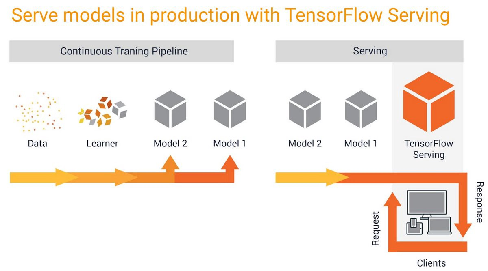

# AI Time Series Prediction Web App for rapid Prototyping

## Introduction
This project aims to build a multi purpose web app template, that makes developement of rapid prototype web apps for time series predictions easy.

As example use case I chose Gold price prediction.

The app delivers:
* [x] Easy to setup time series prediction web app
* [x] Easy ML development and deployment pipeline for "quick and dirty" prototypes
* [x] Based on tensorflow serving which supports serving and inference of multiple models with GPU acceleration


## Installation

The web app consists of two components: 
A frontend with the web user interface, and a backend running a model server with an administrator user interface called 'simple tensorflow serving' [source code](https://github.com/dachkovski/simple_tensorflow_serving)

Install the backend server with:

```bash
cd simple_tensorflow_serving

python ./setup.py install

python ./setup.py develop

bazel build simple_tensorflow_serving:server

```

The frontend app doesnt need an installation. But it needs some packages that are installed with:

```bash
pip install -r ../frontend/requirements.txt

```


## Quick Start

Start the backend server with the TensorFlow [SavedModel](https://www.tensorflow.org/programmers_guide/saved_model).

```bash
cd ../simple_tensorflow_serving
simple_tensorflow_serving --model_base_path="./models/transformer"
```

Check out the admin dashboard in [http://127.0.0.1:8500](http://127.0.0.1:8500) in web browser.
 


Start the frontend web app with:

```bash
python ./frontend/predictor.py
```

Check out the web app in [http://127.0.0.1:3001](http://127.0.0.1:3001) in web browser.
 


## Software Architecture
The app consists of a frontend (client) and a backend, that uses simple Tensorflow serving to deploy, serve and query the model.

The following software architecture description stems from [Source](https://github.com/llSourcell/Make_Money_with_Tensorflow_2.0).
>
>
>
>TensorFlow Serving is a flexible, high-performance serving system for machine learning models, designed for production environments.
>TensorFlow Serving makes it easy to deploy new algorithms and experiments, while keeping the same server architecture and APIs.
>TensorFlow Serving provides out of the box integration with TensorFlow models, but can be easily extended to serve other types of models.
>
>
>Wait, why use Serving instead of a regular web server framework like Flask or Django?
>TensorFlow-Serving allows developers to integrate client requests and data with deep learning models served independently of client systems.
>Benefits of this include clients being able to make inferences on data without actually having to install TensorFlow or even have any contact with the actual model, and the >ability to serve multiple clients with one instance of a model.
>Although we could wrap a simple model in an API endpoint written in a Python framework like Flask, Falcon or similar But there are good reasons we don’t want to do that:
>
>#### Reason #1 - TF Serving is faster
>If the model(s) are complex and run slowly on CPU, you would want to run your models on more accelerated hardware (like GPUs). Your API-microservice(s), on the other hand, >usually run fine on CPU and they’re often running in “everything agnostic” Docker containers. In that case you may want to keep those two kinds of services on different >hardware.
>#### Reason #2 - TF Serving is more space efficient
>If you start messing up your neat Docker images with heavy TensorFlow models, they grow in every possible direction (CPU usage, memory usage, container image size, and so on). >You don’t want that.
>#### Reason #3 - Its going a version control system built in
>Let's say your service uses multiple models written in different versions of TensorFlow. Using all those TensorFlow versions in your Python API at the same time is going to be >a total mess.
>
>You could of course wrap one model into one API. Then you would have one service per model and you can run different services on different hardware. Perfect! Except, this is >what TensorFlow Serving ModelServer is doing for you. So don’t go wrap an API around your Python code (where you’ve probably imported the entire tf library, tf.contrib, >opencv, pandas, numpy, …). TensorFlow Serving ModelServer does that for you. 
