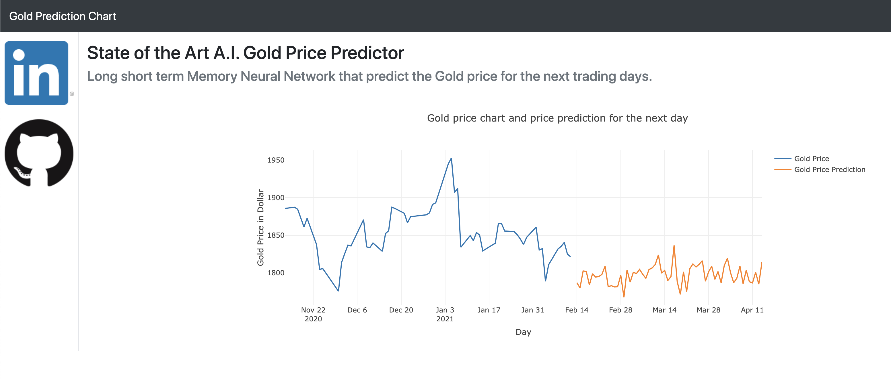

# AI Gold Price Predictor


## Introduction

AI Gold Price Predictor is an web app that predicts the price of Gold for the next trading day. The prediction is made by a state-of-the-art machine learning model based on a transformer neural network. Its purpose is to help traders with their investment decisions with a trustworthy and free open source software.

The app delivers:
* [x] Free trading helper 
* [x] State-of-the-art AI with significant prediction accuracy
* [x] Easy to use and modify software architecture 
* [x] Based on tensorflow serving which supports serving and inference of multiple models with GPU acceleration

The main challenge as for all trading bots is to predict the direction of the price action movement. To find out how the transformer network performs in this field, I chose  "accuracy" as a metric (which is usually used in classification tasks). Here a success is defined that the direction of the prediction is the same, as the actual values for the according trading day.

## Installation

The web app consists of two components: 
A frontend with the web user interface, and a backend running a model server with an administrator user interface called 'simple tensorflow serving' [source code](https://github.com/dachkovski/simple_tensorflow_serving)

Install the backend server with:

```bash
cd simple_tensorflow_serving

python ./setup.py install

python ./setup.py develop

bazel build simple_tensorflow_serving:server

```

The frontend app doesnt need an installation. But it needs some packages that are installed with:

```bash
pip install -r ../frontend/requirements.txt

```


## Quick Start

Start the backend server with the TensorFlow [SavedModel](https://www.tensorflow.org/programmers_guide/saved_model).

```bash
cd ../simple_tensorflow_serving
simple_tensorflow_serving --model_base_path="./models/transformer"
```

Check out the admin dashboard in [http://127.0.0.1:8500](http://127.0.0.1:8500) in web browser.
 


Start the frontend web app with:

```bash
python ./frontend/predictor.py
```

Check out the web app in [http://127.0.0.1:3001](http://127.0.0.1:3001) in web browser.
 



## Analysis

## Methodology

## Results

## Conclusion